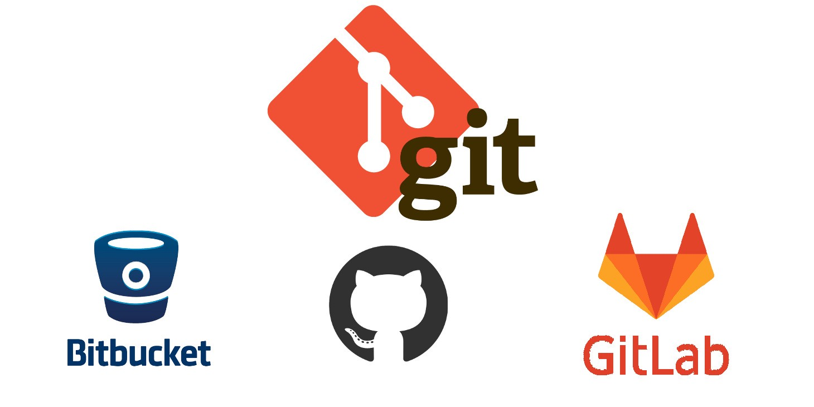

# Version management tactics for Seminar presentations

## Github를 이용하여, Repository의 주요 변동사항을 Branch를 이용해 쉽게 관리해보자

Github를 이용해 PT를 준비하시는 여러분들에게 가장 큰 고충 중 하나인,

> _"지금부터 다 지워야 하는데 어떠카지..."_

를 해결 할 수 있는 좋은 방법을 소개합니다.

---

## Local & Remote

[Git](https://ko.wikipedia.org/wiki/%EA%B9%83_(%EC%86%8C%ED%94%84%ED%8A%B8%EC%9B%A8%EC%96%B4))은 컴퓨터파일의 변동사항을 추적하고, 변동내용을 기록하여 버전관리(Version Control)를 쉽게 해주는 프로그램입니다.

원격(Remote)저장소란, 현재 여러분이 보시고 계신 Github와 같은 회사가 제공하거나, 알고있는 다른 서버에 있는 저장소를 의미합니다.

정확하게는 해당 서버컴퓨터가 Git을 지원하고, 그 서버에 접속하는 사용자에게 Git을 사용하기 편리하게 인터페이스를 제공하는것을 말합니다.



여러분은 이 사이트(Github)에서 새로운 Repo를 작성하거나, 삭제하는것 뿐만 아니라 Collborator 관리, 사용자 이슈 확인 등, 프로젝트 관리에 필요한 많은 작업을 하실 수 있습니다.

여러분의 컴퓨터(Local)에서 작성된 프로그램과 그 변동사항을 원격저장소에 업로드(Push)하는 것은, 여러분들이 **어디서라도 인터넷이 연결된 환경에서 해당 프로그램의 변동사항을 내려받아 작업을 재개할 수 있음**을 뜻합니다.

이는 훗날 여러분들이 혼자가 아닌 팀 프로젝트를 할 때, 물리적으로 떨어져 있는 여러대의 컴퓨터를 사용하는 팀원들과 효율적으로 작업할 수 있게 합니다.

> _이러한 도구가 없다면, 여러분들은 카톡이나 이메일로 변동사항이 있을때마다 압축해서 여러명에게 전송해야합니다! 물론, 에러나 버그를 수정할 때 마다!!_

---

## Commit & Branch

다들 아시다시피, 아래 명령어를 통해 현재 디렉토리를 Git Repositor로 만들 수 있습니다.

```
> git init
Initialized empty Git repository in "여러분의 작업 디렉토리"/.git/
```

이제부터 Git은 디렉토리 내부에 `.git`이라는 하위 디렉토리를 생성하여, 해당 공간을 데이터베이스로 사용합니다.

위 작업을 마치면, Git은 해당 디렉토리와 관련된 여러 명령줄도구(Command line tools)를 제공합니다.

이제 특정 파일을 Git이 추적하도록 하겠습니다. 추적할 파일은 현재 이 파일, `README.MD`입니다.

```
> git add README.MD
```


