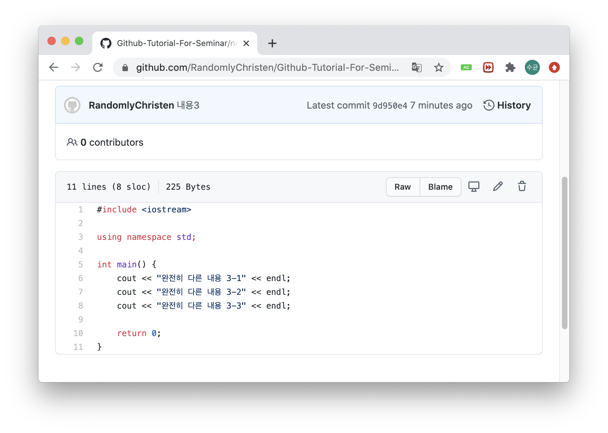
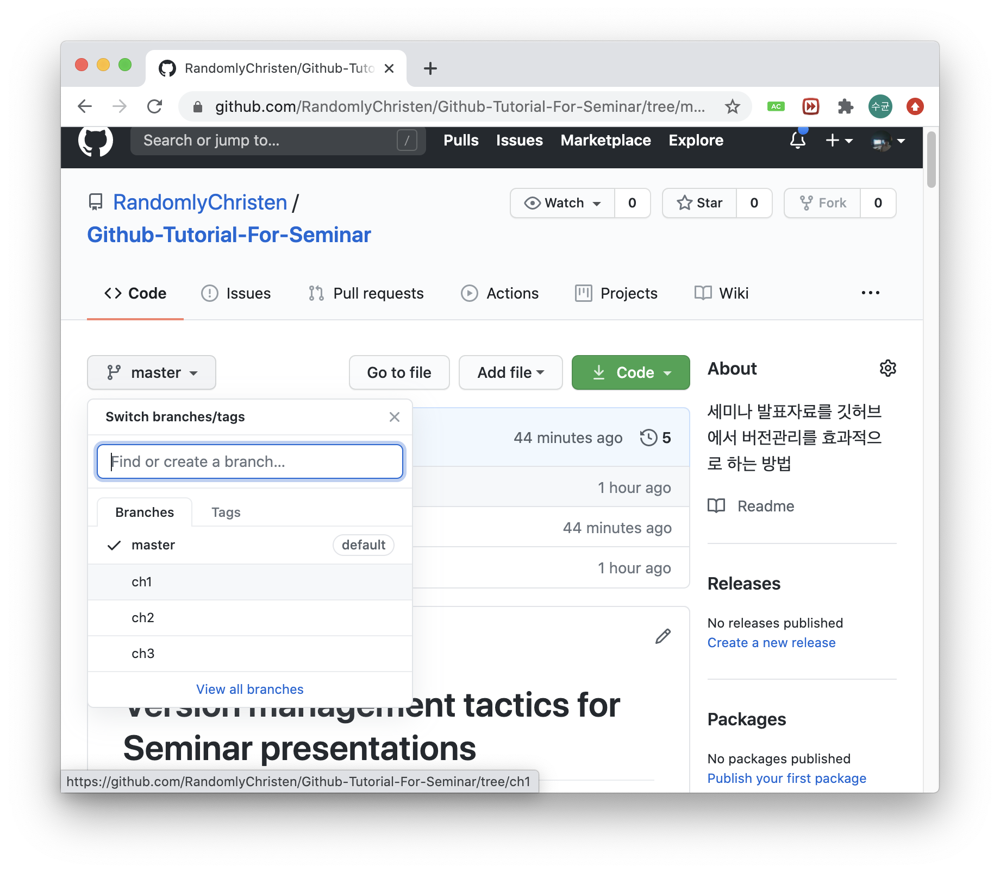

# Version management tactics for Seminar presentations

## Github를 이용하여, Repository의 주요 변동사항을 Branch를 이용해 쉽게 관리해보자

Github를 이용해 PT를 준비하시는 여러분들에게 가장 큰 고충 중 하나인,

> _"지금부터 다 지워야 하는데 어떠카지..."_

를 해결 할 수 있는 좋은 방법을 소개합니다.

---

## Local & Remote

[Git](https://ko.wikipedia.org/wiki/%EA%B9%83_(%EC%86%8C%ED%94%84%ED%8A%B8%EC%9B%A8%EC%96%B4))은 컴퓨터파일의 변동사항을 추적하고, 변동내용을 기록하여 버전관리(Version Control)를 쉽게 해주는 프로그램입니다.

원격(Remote)저장소란, 현재 여러분이 보시고 계신 Github와 같은 회사가 제공하거나, 알고있는 다른 서버에 있는 저장소를 의미합니다.

정확하게는 해당 서버컴퓨터가 Git을 지원하고, 그 서버에 접속하는 사용자에게 Git을 사용하기 편리하게 인터페이스를 제공하는것을 말합니다.


여러분은 이 사이트(Github)에서 새로운 Repo를 작성하거나, 삭제하는것 뿐만 아니라 Collborator 관리, 사용자 이슈 확인 등, 프로젝트 관리에 필요한 많은 작업을 하실 수 있습니다.

여러분의 컴퓨터(Local)에서 작성된 프로그램과 그 변동사항을 원격저장소에 업로드(Push)하는 것은, 여러분들이 **어디서라도 인터넷이 연결된 환경에서 해당 프로그램의 변동사항을 내려받아 작업을 재개할 수 있음**을 뜻합니다.

이는 훗날 여러분들이 혼자가 아닌 팀 프로젝트를 할 때, 물리적으로 떨어져 있는 여러대의 컴퓨터를 사용하는 팀원들과 효율적으로 작업할 수 있게 합니다.

> _이러한 도구가 없다면, 여러분들은 카톡이나 이메일로 변동사항이 있을때마다 압축해서 여러명에게 전송해야합니다! 물론, 에러나 버그를 수정할 때 마다!!_

---

## Commit & Branch

다들 아시다시피, 아래 명령어를 통해 현재 디렉토리를 Git Repositor로 만들 수 있습니다.

```
> git init

Initialized empty Git repository in "작업공간경로"/.git/
```

이제부터 Git은 디렉토리 내부에 `.git`이라는 하위 디렉토리를 생성하여, 해당 공간을 데이터베이스로 사용합니다.

위 작업을 마치면, Git은 해당 디렉토리와 관련된 여러 명령줄도구(Command line tools)를 제공합니다.

이제 특정 파일을 Git이 추적하도록 하겠습니다. 추적할 파일은 현재 이 파일, `README.MD`입니다.

```
> git add README.MD
```

지금까지의 변동내용을 확인하기 위해 아래 명령을 입력하면, 아직 commit 되지 않았으며, 새로운 파일과 변동사항이 있는 파일을 말해줍니다.

```
> git status

On branch master

No commits yet

Changes to be committed:
  (use "git rm --cached <file>..." to unstage)
        new file:   README.MD

Changes not staged for commit:
  (use "git add <file>..." to update what will be committed)
  (use "git restore <file>..." to discard changes in working directory)
        modified:   README.MD
```

지금까지의 추가된 파일, 제거된 파일, 변동사항을 기록하기위해 Commit 해야합니다.

```
> git commit -m "첫번째 커밋입니다. README.MD 추가"

[master (root-commit) fc0477c] 첫번째 커밋입니다. README.MD 추가
 1 file changed, 52 insertions(+)
 create mode 100644 README.MD
```

Repository안에 있는 파일은 Git에의해 아래와 같이 관리 됩니다.


Commit시 출력되는 설명 중, `master`는 기본적으로 설정된 **Branch**입니다.

Branch는 현재 버전과 독립적으로 진행하고싶은 과제가 있는경우 사용합니다. Branch 생성 시점을 정의할 수 있으며, 해당 Branch에 Commit되거나 Pull(불러오기)되는 내용은 다른 Branch에 영향을 받지 않습니다.

Branch가 서로 충돌이 없다면(마지막 변동사항이 서로 다른 파일이 없음을 의미) 서로 합칠 수 있습니다. 이 과정을 Merge라고하며, 이번 세미나에서는 협업 중점이 아니므로, 특별히 다루지 않습니다.


---

## 본격적으로 버전관리 해보기

지금까지 배운 내용을 실전에서 바로 사용해보겠습니다.

우선 우리가 하나의 C++파일을 작성했다고 해봅시다.

```cpp
#include <iostream>

using namespace std;

int main() {
    cout << "내용 1-1" << endl;
    cout << "내용 1-2" << endl;
    cout << "내용 1-3" << endl;
    cout << "내용 1-4" << endl;
    cout << "내용 1-5" << endl;
    return 0;
}
```

지금까지 우리의 작업내용은 아래의 결과물을 출력하기 위한 프로그램의 작성입니다.

```
내용 1-1
내용 1-2
내용 1-3
내용 1-4
내용 1-5
```

그리고 이 파일을 비롯하여, 이 디렉토리 내의 모든 파일을 Git이 추적하게 하기 위해 아래 명령을 터미널에 입력합니다.

```
> git add .
```

그리고 Commit을 통해 변동사항을 기록합니다.

<a id='b6836f0'></a>
```
> git commit -m "내용1"

[master b6836f0] 내용1
 5 files changed, 86 insertions(+), 1 deletion(-)
 create mode 100644 image/0_k7SKKyyBpytE9jw4.jpg
 create mode 100644 image/git-branches-merge.png
 create mode 100644 image/lifecycle.png
 create mode 100644 test_program.cpp
```

`README.MD`에서 보여질 이미지파일을 비롯하여 우리의 프로그램이 정성적으로 Commit되었습니다.

이제 `test_program.cpp`를 아래와 같이 변경해야한다고 하죠.

```cpp
#include <iostream>

using namespace std;

int main() {
    cout << "내용 2-1" << endl;
    cout << "내용 2-2" << endl;
    cout << "내용 2-3" << endl;
    return 0;
}
```

1장 내용을 모두 지우고, 2장 내용을 입력했습니다. 소단원이 3개밖에 없네요 개꿀이죠? 하지만 여러분들은 이렇게 생각합니다.

> _"열심히 작성했던 코드를 모두 지워야 하다니... 거기다가 다른 사람은 이 내용을 보지 못하잖아!!"_

**하지만, 여러분이 했던 작업이 절대 날아간것이 아닙니다. 걱정하지마세요.**

그리고 지금까지의 작업을 기록하겠습니다. 추가될 파일은 없지만, 습관적으로 `add` 해줍니다.

<a id='7949bf0'></a>
```
> git add .
> git commit -m "내용2"

[master 7949bf0] 내용2
 2 files changed, 55 insertions(+), 5 deletions(-)
```

3장에서는 좀 더 극단적으로, 위 소스파일을 삭제하고 새로운 파일을 작성합니다.

Git이 파일이 삭제되어 추적할 필요가 없어짐을 알아차리게 하기 위해서는 아래 명령으로 파일의 삭제를 진행합니다.

```
> git rm test_program.cpp 

rm 'test_program.cpp'
```

그리고 새 파일 `new_program.cpp`를 작성합니다.

```cpp
#include <iostream>

using namespace std;

int main() {
    cout << "완전히 다른 내용 3-1" << endl;
    cout << "완전히 다른 내용 3-2" << endl;
    cout << "완전히 다른 내용 3-3" << endl;

    return 0;
}
```

이번엔 하나의 파일이 삭제, 하나의 파일이 추가 그리고 변경사항이 기록되겠네요.

<a id='9d950e4'></a>
```
> git add .
> git commit -m "내용3"

[master 9d950e4] 내용3
 3 files changed, 51 insertions(+), 15 deletions(-)
 create mode 100644 new_program.cpp
 delete mode 100644 test_program.cpp
```

지금까지의 내용을 Github 원격저장소에 업로드 해보겠습니다.

```
> git commit -m "첫번째 푸쉬"

[master 2cf29f0] 첫번째 푸쉬
 1 file changed, 13 insertions(+)

> git push origin master

Enumerating objects: 22, done.
Counting objects: 100% (22/22), done.
Delta compression using up to 12 threads
Compressing objects: 100% (21/21), done.
Writing objects: 100% (22/22), 84.28 KiB | 21.07 MiB/s, done.
Total 22 (delta 5), reused 0 (delta 0)
remote: Resolving deltas: 100% (5/5), done.
To https://github.com/RandomlyChristen/Github-Tutorial-For-Seminar.git
 * [new branch]      master -> master
```

지금까지로의 결과물로 Github에 접속하면 우리는 `new_program.cpp`와 `README.MD` 그리고 이미지파일들만 확인 할 수 있습니다.



이제 ~~마법~~을 통해 클릭 몇번으로 이전 내용의 프로젝트를 확인할 수 있게 해보겠습니다.

우선 우리는 프로젝트에서 **3번의 주요 저장지점**이 있었습니다.

1. [요기랑](#b6836f0)
1. [요기](#7949bf0)
1. [그리고 요기](#9d950e4)

이 세 구간에대해 독립적인 분기점을 만들어 줄 수 있습니다. 바로 Branch를 통해서요. 

아래 명령을 입력하면, 특정 Commit에서 Branch를 생성합니다.

```
> git branch "Branch 이름" "Commit SHA"
```

Commit 명령 이후에 출력되는 `[master b6836f0] 내용1 ...`에서 `b6836f0`가 바로 Commit SHA 값입니다.

이를 이용하면 아래를 생각해볼 수 있습니다.

```
> git branch "ch1" "b6836f0"
> git branch "ch2" "7949bf0"
> git branch "ch3" "9d950e4"
```

이제 해당 브랜치로 이동할 수 있습니다.

```
> git checkout "ch1"

Switched to branch 'ch1'

> git checkout "ch2"

Switched to branch 'ch2'

> git checkout "ch3"

Switched to branch 'ch3'

> git checkout master

Switched to branch 'master'
```

반갑게도 그 때 그 모습 그대로내요!! 추억돋습니다. 이제 생성된 Branch를 Github Remote에 Push 해주면 됩니다.

```
> git push origin ch1:ch1

Total 0 (delta 0), reused 0 (delta 0)
remote: 
remote: Create a pull request for 'ch1' on GitHub by visiting:
remote:      https://github.com/RandomlyChristen/Github-Tutorial-For-Seminar/pull/new/ch1
remote: 
To https://github.com/RandomlyChristen/Github-Tutorial-For-Seminar.git
 * [new branch]      ch1 -> ch1

 > git push origin ch2:ch2

 ...

 > git push origin ch3:ch3

 ...
```

이제 Github에서 확인해볼 수 있습니다. `master`외의 3개의 Branch가 있는것을 확인할 수 있네요.



**소스코드와 파일의 변경내용을 직접 확인해보세요!!**